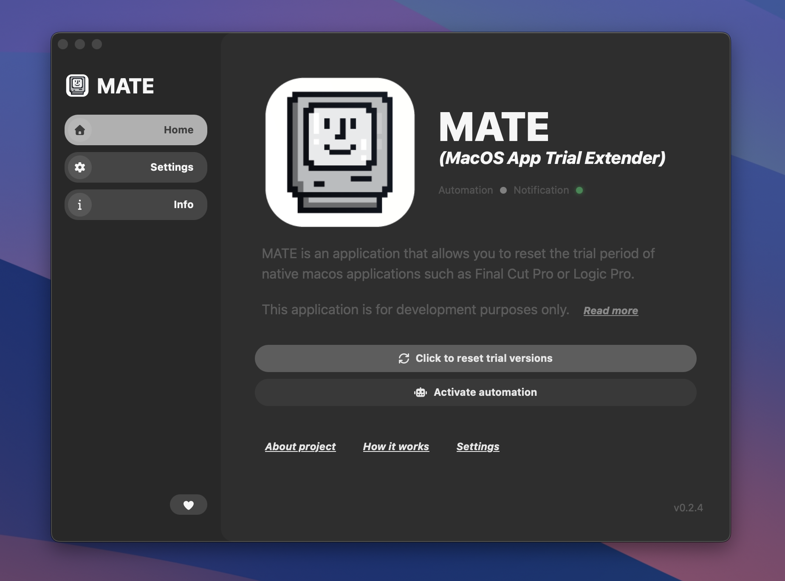
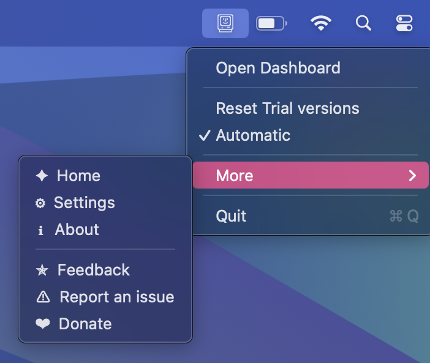
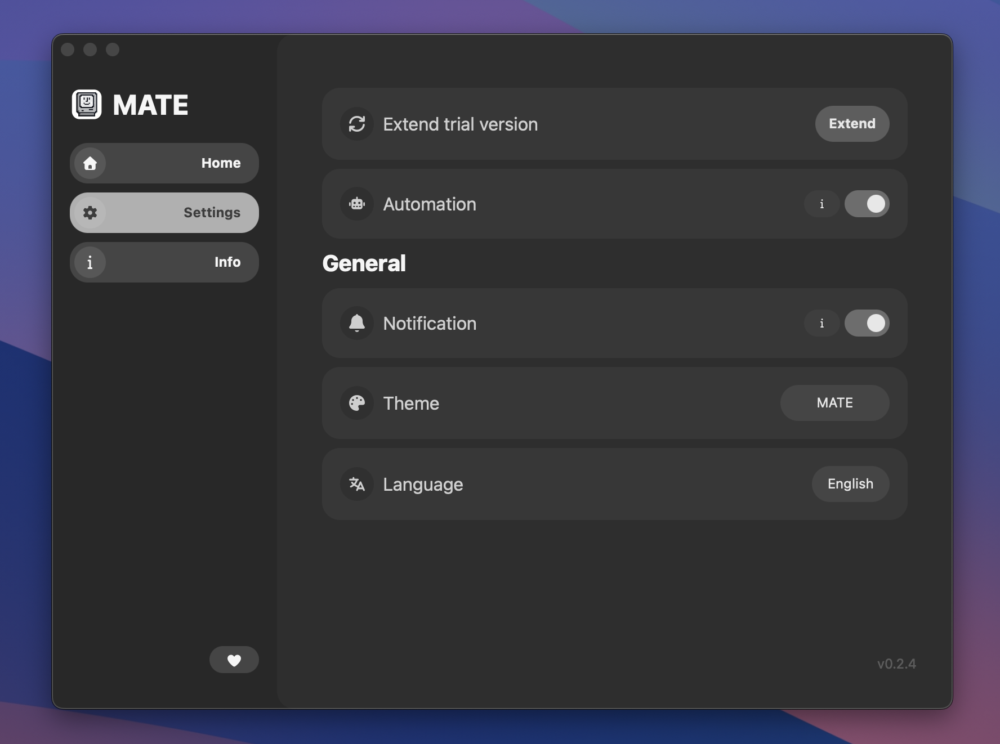

<!-- File autogenerated by .dovenv/readme.js. Please do not edit HERE cause it will be overwritten -->
<!--
██████╗ ██╗ ██████╗ ███████╗ ██████╗ ███╗   ██╗██████╗  ██████╗ ███████╗███████╗███████╗
██╔══██╗██║██╔════╝ ██╔════╝██╔═══██╗████╗  ██║██╔══██╗██╔═══██╗██╔════╝██╔════╝██╔════╝
██████╔╝██║██║  ███╗█████╗  ██║   ██║██╔██╗ ██║██████╔╝██║   ██║███████╗███████╗█████╗  
██╔═══╝ ██║██║   ██║██╔══╝  ██║   ██║██║╚██╗██║██╔═══╝ ██║   ██║╚════██║╚════██║██╔══╝  
██║     ██║╚██████╔╝███████╗╚██████╔╝██║ ╚████║██║     ╚██████╔╝███████║███████║███████╗
╚═╝     ╚═╝ ╚═════╝ ╚══════╝ ╚═════╝ ╚═╝  ╚═══╝╚═╝      ╚═════╝ ╚══════╝╚══════╝╚══════╝
                                                                                        
                                                                                        
                                                                                        
█████╗█████╗█████╗█████╗█████╗█████╗█████╗                                              
╚════╝╚════╝╚════╝╚════╝╚════╝╚════╝╚════╝                                              
                                                                                        
                                                                                        
                                                                                        
███╗   ███╗ █████╗ ████████╗███████╗                                                    
████╗ ████║██╔══██╗╚══██╔══╝██╔════╝                                                    
██╔████╔██║███████║   ██║   █████╗                                                      
██║╚██╔╝██║██╔══██║   ██║   ██╔══╝                                                      
██║ ╚═╝ ██║██║  ██║   ██║   ███████╗                                                    
╚═╝     ╚═╝╚═╝  ╚═╝   ╚═╝   ╚══════╝                                                    
                                                                                                            
                                                
VERSION: 	1.0.1 
REPOSITORY: https://github.com/angelespejo/macos-app-trial-extender
AUTHORS: 
	- Angelo (https://github.com/angelespejo)

DEVELOPED BY PigeonPosse 🐦🌈

-->

# MATE - MacOS App Trial Extender

MATE is an application that allows you to reset the trial period of native macos applications such as Final Cut Pro or Logic Pro.

> This application is for **development** purposes only.

## Download

## Screenshots

### macOS Menu Bar

You can use the app in the background without opening the main window from the menu bar icon.

### App settings
The application has a configuration section so you can configure the app as you like.

## Custom themes
As a bonus, and thanks to [alejomalia](https://github.com/alejomalia) for creating the icons, we've added a feature to change the app's theme 🌈.
Since the app is based on **Final Cut** and **Logic Pro**, we've included a theme honoring each, as well as an extra theme in homage to the **Macintosh 1**, reflecting the shape of its iconic logo.

### MATE Theme (default)

### Finalcut Theme

### Logic Pro Theme

### Macintosh Theme

## 👨‍💻 Contribute

You can contribute via **_Github_**.

### Want to contribute as a tester?

Notifying that you've tested the app and that it works on your operating system, add the test information [here](.dovenv/app.info.ts) and make a **pull request**!

### How ?

1. [**fork**](https://docs.github.com/es/pull-requests/collaborating-with-pull-requests/working-with-forks/fork-a-repo) repository.
2. Run `pnpm install` to install dependencies and tools.
3. Run `pnpm add-test` to add a test.
   All you have to do is answer the questions and the test will complete automatically.
4. Make a [**pull request**](https://github.blog/developer-skills/github/beginners-guide-to-github-creating-a-pull-request/)

## ☕ Donate

Help us to develop more interesting things.

## 📜 License

This software is licensed with **[GPL-3.0](./LICENSE)**.

## 🐦 About us

_PigeonPosse_ is a ✨ **code development collective** ✨ focused on creating practical and interesting tools that help developers and users enjoy a more agile and comfortable experience. Our projects cover various programming sectors and we do not have a thematic limitation in terms of projects.

## Contributors

|   | Name | Role |
| ----- | ---- | ---- |
|  | [Angelo](https://github.com/angelespejo) | 👑 Author |
|  | [Alejo Malia](https://github.com/alejomalia) | 🎨 Brand Designer |
|  | [YinMo19](https://github.com/YinMo19) | 💻 Contributor |
|  | [PigeonPosse](https://pigeonposse.com) | 🏢 Organization |

 

